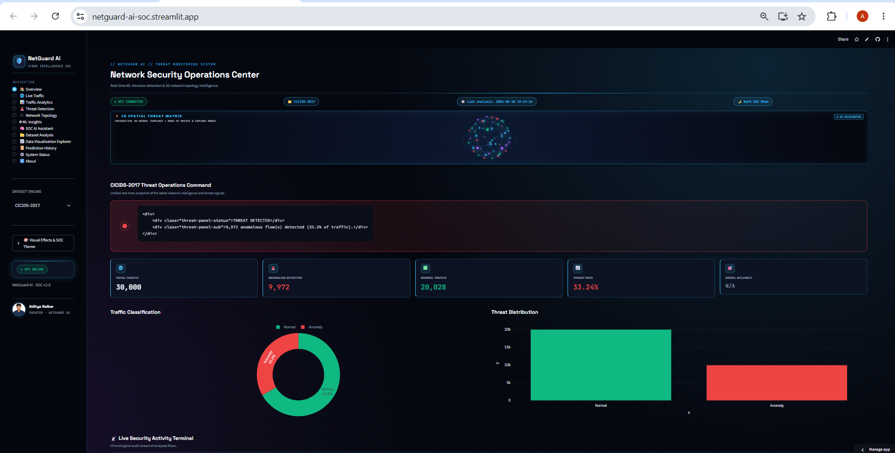
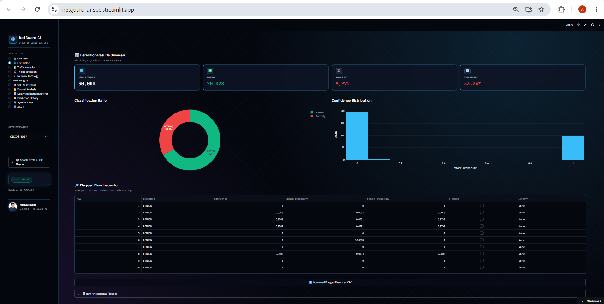
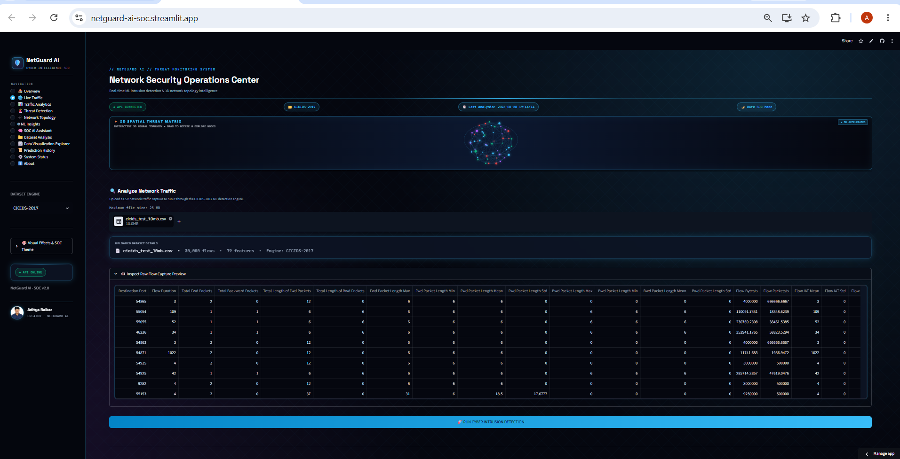
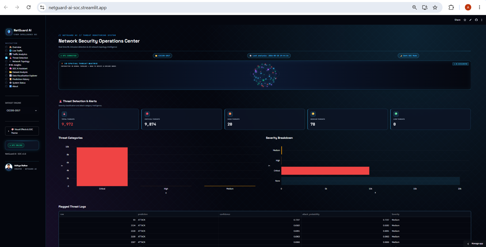
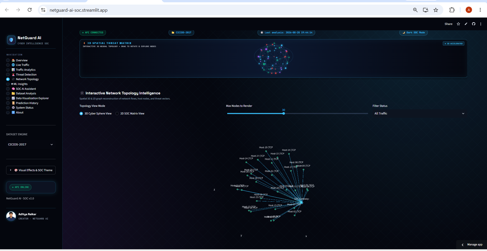
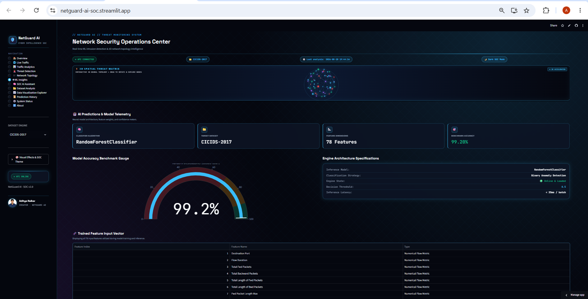
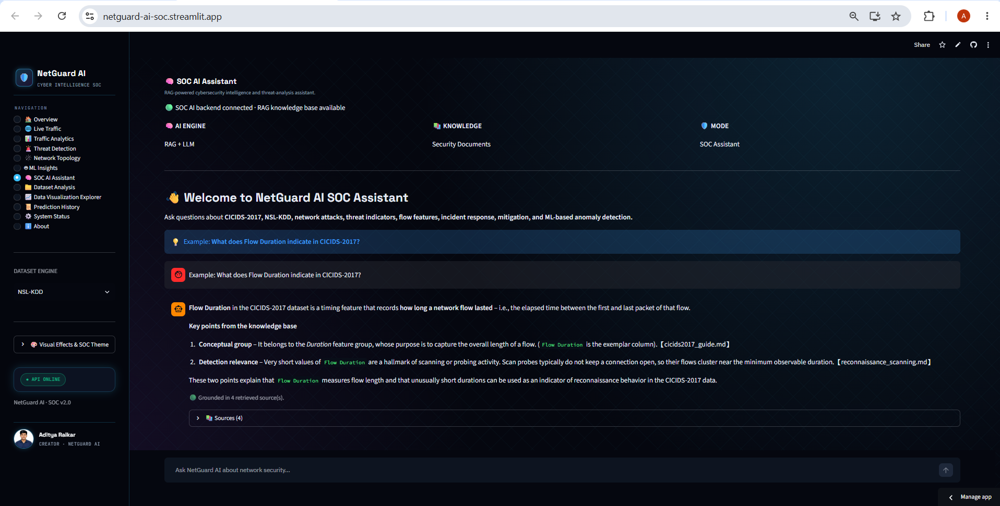
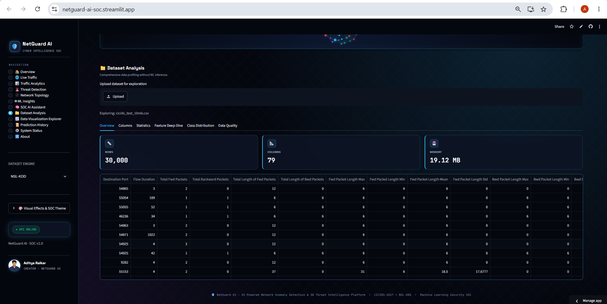
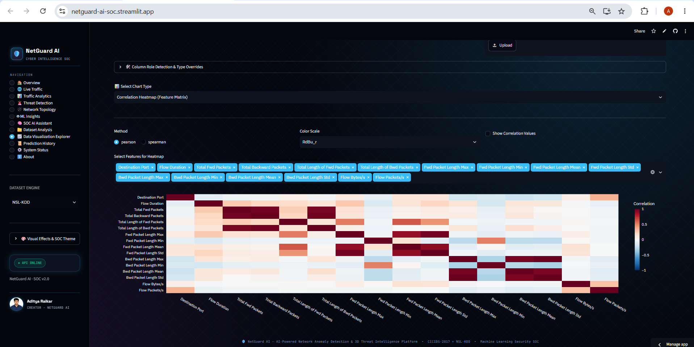
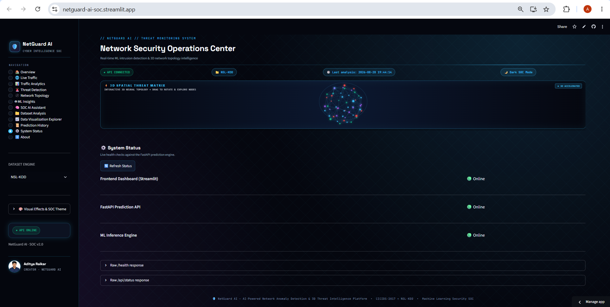

# 🛡️ NetGuard AI — Network Anomaly Detection & SOC Platform

> **AI-Powered Network Intrusion Detection System (NIDS) + Security Operations Center (SOC) Platform**
> Built for the **Major Project** (Bachelor of Engineering — Computer Science) by **Aditya Raikar**.


---

## 📌 Table of Contents

1. [Project Overview](#-project-overview)
2. [Key Features](#-key-features)
3. [System Architecture](#-system-architecture)
4. [Project Structure](#-project-structure)
5. [Datasets Used](#-datasets-used)
6. [Machine Learning Pipeline](#-machine-learning-pipeline)
7. [Model Performance](#-model-performance)
8. [RAG Knowledge Base](#-rag-knowledge-base-agentic-soc-assistant)
9. [API Endpoints](#-api-endpoints)
10. [Installation & Setup](#-installation--setup)
11. [Running the Application](#-running-the-application)
12. [Testing](#-testing)
13. [Results & Visualizations](#-results--visualizations)
14. [Web Application Screenshots](#-web-application-screenshots)
15. [Technologies Used](#-technologies-used)
16. [Future Enhancements](#-future-enhancements)
17. [Author](#-author)

---

## 📖 Project Overview

Cyber attacks are increasing rapidly, making automated network security more critical than ever. **NetGuard AI** is a complete, end-to-end **Network Intrusion Detection System (NIDS)** and **Security Operations Center (SOC)** platform that automatically classifies network traffic as **Normal / Benign** or **Malicious (Attack)** using **Machine Learning**.

The platform is trained and evaluated on two benchmark cybersecurity datasets:

- **NSL-KDD** (KDDTrain+ / KDDTest-21)
- **CICIDS-2017**

using the **Random Forest Classifier**. On top of the ML core, the project ships a production-style **FastAPI backend** and a rich **Streamlit SOC dashboard**, plus a **RAG-powered AI assistant** that answers security questions from a curated local knowledge base.

The system classifies traffic, computes **attack probability**, **confidence**, **risk scores**, and **severity**, and surfaces everything through an interactive threat-detection console.

---

## ✨ Key Features

- **Dual-Dataset Anomaly Detection**
  - Trained models for both **CICIDS-2017** (78 features) and **NSL-KDD** (41 features).
  - Binary classification: `BENIGN/NORMAL` vs `ATTACK`.

- **Production FastAPI Backend**
  - REST endpoints for single-flow prediction and CSV file analysis.
  - Automatic dataset-type detection (CICIDS vs NSL-KDD).
  - CORS enabled, health/status endpoints, structured error handling.

- **RAG-Powered SOC AI Assistant**
  - Retrieval-Augmented Generation over a curated **markdown knowledge base**.
  - Embedding + vector-store retrieval with a **Three-Level Evidence Strategy**.
  - Multi-provider LLM support: **Gemini, OpenAI, Groq, Ollama**, with automatic fallback and offline mode.
  - **Out-of-domain refusal** — politely declines unrelated questions.

- **Rich Streamlit SOC Dashboard**
  - Dark cyber / light enterprise **theme system** with glassmorphism + neon glow.
  - 12 navigation pages: Overview, Live Traffic, Traffic Analytics, Threat Detection, Network Topology (3D), ML Insights, SOC AI Assistant, Dataset Analysis, Data Visualization Explorer, Prediction History, System Status & About.
  - **Interactive 3D neural topology visualizer** (WebGL/Canvas).
  - Severity badges, threat status radar panels, KPI metric cards, live SOC activity feed.
  - 10+ color presets including **Colorblind-Safe (Okabe-Ito)**.

- **Risk & Severity Scoring**
  - Each prediction includes `confidence`, `attack_probability`, `risk_score (0–100)` and `severity (MINIMAL/LOW/MEDIUM/HIGH/CRITICAL)`.

- **Threshold Tuning**
  - NSL-KDD attack threshold is configurable; validated against KDDTest-21 to balance precision/recall.

---

## 🏗️ System Architecture

```
┌─────────────────────────────────────────────────────────────────┐
│                    STREAMLIT SOC DASHBOARD (Frontend)           │
│   Overview · Live Traffic · Threat Detection · 3D Topology ·    │
│   ML Insights · SOC AI Assistant · Dataset Analysis · Explorer   │
└───────────────────────────────┬─────────────────────────────────┘
                                │  HTTP (requests) 127.0.0.1:8000
┌───────────────────────────────▼─────────────────────────────────┐
│                    FASTAPI BACKEND  (app.py)                     │
│   /predict/cicids · /predict/nsl-kdd · /analyze/*  · /chat       │
└───────┬─────────────────────────────┬───────────────────────────┘
        │                             │
┌───────▼────────────────┐   ┌────────▼───────────────────────────┐
│   ML INFERENCE ENGINE   │   │        RAG ASSISTANT                │
│  (src/prediction_engine)│   │   Retriever → Prompt → LLM          │
│  CICIDS model           │   │   Gemini / OpenAI / Groq / Ollama   │
│  NSL-KDD model          │   │   Offline fallback + refusal        │
└───────┬────────────────┘   └────────┬───────────────────────────┘
        │                            │
┌───────▼─────────────┐   ┌──────────▼─────────────────────────────┐
│ MODELS (artifacts)  │   │  KNOWLEDGE BASE (backend/rag)          │
│  .pkl pickles       │   │  documents/*.md → chunks → embeddings  │
│  + encoders         │   │  → vector store (npy / json / pkl)     │
└─────────────────────┘   └────────────────────────────────────────┘
```

**Flow:**
1. The **Streamlit UI** sends feature vectors or uploaded datasets to the **FastAPI backend**.
2. The backend routes to the **ML inference engine** (`NetworkPredictionEngine`), which loads the trained `.pkl` models, validates/pre-processes features, predicts, and computes risk + severity.
3. The **SOC AI Assistant** retrieves relevant chunks from the RAG knowledge base, builds a grounded prompt, and calls a live LLM (or falls back to offline knowledge).
4. Results are returned as JSON and rendered as charts, badges, and threat panels.

---

## 📂 Project Structure

```text
Network Anamoly Detection/
│
├── backend/                      # Backend services
│   ├── main.py                   # Legacy FastAPI entry point
│   ├── app.py                    # (moved to frontend/app.py — primary API)
│   ├── predictor.py              # Model API adapter + validation
│   ├── dataset_analyzer.py       # Uploaded dataset inspection/type detection
│   ├── rag/                      # RAG subsystem
│   │   ├── config.py             # Central RAG + LLM configuration
│   │   ├── chunking.py           # Document chunking
│   │   ├── embeddings.py         # Embedding engine (TF-IDF / multi-provider)
│   │   ├── vector_store.py       # Persistent vector store
│   │   ├── ingestion.py          # Ingestion pipeline (docs → index)
│   │   ├── retriever.py          # Similarity retrieval
│   │   ├── generator.py          # Prompt builders + LLM dispatch
│   │   ├── prompts.py            # Prompt templates / system prompts
│   │   ├── documents/            # 🔎 Curated markdown knowledge base
│   │   ├── documents_backup/     # Backup of knowledge-base docs
│   │   ├── vector_store/         # Pre-built index (chunks/embeddings)
│   │   └── cache/                # Embedding / vectorizer caches
│   │
├── frontend/                     # Application layer
│   ├── app.py                    # ⭐ Primary FastAPI backend (all endpoints)
│   ├── dashboard.py              # ⭐ Streamlit SOC dashboard (12 pages)
│   └── api.py                    # Streamlit → Backend API client wrapper
│
├── src/                          # Core ML source
│   ├── prediction_engine.py      # Central inference engine
│   ├── cicids_analyzer.py        # CICIDS CSV analysis
│   ├── nsl_kdd_analyzer.py       # NSL-KDD file analysis + statistics
│   ├── cicids_preprocessing.py   # CICIDS load/clean/label-encode
│   ├── cicids_train_model.py     # Train CICIDS model
│   ├── cicids_model_evaluation.py# Evaluate CICIDS model
│   ├── nsl_kdd_preprocessing.py  # NSL-KDD load/encode/split
│   ├── nsl_kdd_train_model.py    # Train NSL-KDD model
│   └── nsl_kdd_model_evaluation.py # Evaluate NSL-KDD model
│
├── data/                         # Datasets
│   ├── NSL-KDD/                  # KDDTrain+.txt, KDDTest-21.txt
│   └── CICIDS-2017/              # Per-day pcap_ISCX CSV files + samples
│
├── models/                       # Trained model artifacts (.pkl)
│   ├── cicids_anomaly_model.pkl
│   ├── cicids_label_encoder.pkl
│   ├── nsl-kdd_anomaly_model.pkl
│   └── nsl-kdd_label_encoder.pkl
│
├── notebooks/                    # Jupyter training notebooks
│   ├── cicids2017_model_train.ipynb
│   └── nsl-kdd_model_train.ipynb
│
├── reports/                      # Generated evaluation artifacts
│   ├── cicids_model_metrics.txt
│   ├── nsl-kdd_model_metrics.txt
│   ├── *confusion_matrix.png
│   ├── *roc_curve.png
│   └── *feature_importance.png
│
├── tests/                        # Engine & integration checks
│   ├── test_prediction_engine.py
│   └── test_real_predictions.py
│
├── check_threshold.py            # NSL-KDD attack-threshold tuning utility
├── requirements.txt              # Python dependencies
├── .streamlit/config.toml        # Streamlit theme/server config
├── .env                          # API keys (see .env.example)
└── README.MD                     # This file
```

> The application entry points are **`frontend/app.py`** (FastAPI backend) and **`frontend/dashboard.py`** (Streamlit UI). The pre-built RAG vector store is already included under `backend/rag/vector_store/`, so the chatbot works out of the box.

---

## 🗂️ Datasets Used

### NSL-KDD
A refined version of the classic KDD'99 dataset that removes redundant records, enabling fair and reliable evaluation.

- `KDDTrain+.txt` — training set
- `KDDTest-21.txt` — validation/testing set
- **41 network-traffic features** + attack `label` + `difficulty` level.
- Binary task: `normal` vs `attack`.

### CICIDS-2017
A modern intrusion-detection dataset built from real-world captured network traffic using the CICFlowMeter tool.

- Contains **78 numerical flow features**.
- Attack classes consolidated to binary: `BENIGN` vs `ATTACK`.

Attack categories covered include:

| Category | Example |
|----------|---------|
| **DDoS** | Distributed Denial of Service |
| **DoS** | Denial of Service |
| **Port Scan** | Reconnaissance scanning |
| **Web Attacks** | SQL injection / XSS / brute force |
| **Infiltration** | Data exfiltration |
| **Brute Force** | Credential attacks |
| **Botnet** | C2 / bot coordination |
| **Normal** | Benign traffic |

---

## ⚙️ Machine Learning Pipeline

```
Raw Dataset
      │
      ▼
Data Cleaning        (strip columns, drop NaN, handle Inf)
      │
      ▼
Feature Encoding     (LabelEncoder for categorical, numeric coercion)
      │
      ▼
Binary Label         (BENIGN/NORMAL → 0, ATTACK → 1)
      │
      ▼
Train-Test Split     (stratified)
      │
      ▼
Random Forest Training
      │
      ▼
Prediction           (predict + predict_proba)
      │
      ▼
Risk & Severity      (attack_probability → risk_score → severity)
      │
      ▼
Evaluation           (accuracy, precision, recall, F1, ROC-AUC)
      │
      ▼
Outputs              (confusion matrix, ROC curve, feature importance)
```

### Why Random Forest?
- High accuracy and robustness against overfitting.
- Handles large, high-dimensional datasets efficiently.
- Built-in feature-importance analysis.
- Fast training and very fast prediction (suitable for real-time SOC use).
- Works well with `predict_proba` for confidence/risk scoring.

---

## 📊 Model Performance

Metrics exported from the evaluation reports in `reports/`.

### NSL-KDD Results

| Metric | Score |
|------------|------------|
| Training Accuracy | **99.96%** |
| Testing Accuracy | **99.91%** |
| Precision | **99.95%** |
| Recall | **99.86%** |
| F1 Score | **99.90%** |
| ROC-AUC | **0.999992** |
| Confusion Matrix | `[[13463 6] [17 11709]]` |

### CICIDS-2017 Results

| Metric | Score |
|------------|------------|
| Training Accuracy | **99.91%** |
| Testing Accuracy | **99.89%** |
| Precision | **99.97%** |
| Recall | **99.89%** |
| F1 Score | **99.93%** |
| ROC-AUC | **1.0000** |

> Model files, encoders, and full metric reports are stored in `models/` and `reports/`.

---

## 🧠 RAG Knowledge Base (Agentic SOC Assistant)

The **SOC AI Assistant** (`/chat`) answers cybersecurity questions using **Retrieval-Augmented Generation** over a curated local knowledge base at `backend/rag/documents/`.

### Knowledge Base Categories

- **System Architecture** — NetGuard AI overview, RAG chunking, embeddings, retriever, vector store.
- **Datasets & ML** — CICIDS-2017 and NSL-KDD guides, severity/confidence guidance.
- **Network Security** — botnets & C2, brute-force credentials, DoS/DDoS attacks, reconnaissance/scanning, web & infiltration.
- **SOC Procedures** — incident response, mitigation & hardening.
- **Definitions & Concepts** — network anomaly detection fundamentals.

### How It Works

1. **Ingestion** — documents are chunked (configurable `CHUNK_SIZE`/`OVERLAP`) and embedded into a persistent vector store.
2. **Retrieval** — embeddings are compared to the query; the top-K most similar chunks above a **similarity threshold** are selected (`RAG_SIMILARITY_THRESHOLD`, default `0.26`).
3. **Three-Level Evidence Strategy** — answers are grounded in retrieved context (Level 1), partial coverage is qualified (Level 2), or a knowledgeable response is withheld when no reliable evidence exists (Level 3).
4. **LLM Generation** — the grounded prompt is sent to the configured provider (`gemini`, `openai`, `groq`, `ollama`, or `auto`), with a hard timeout and automatic multi-provider fallback.
5. **Offline / Refusal** — if the LLM is unavailable, a clean local knowledge-base answer is returned; clearly out-of-domain questions are politely refused.

### Configuration (`.env`)

| Variable | Default | Purpose |
|----------|---------|---------|
| `LLM_PROVIDER` | `gemini` | `auto`, `gemini`, `openai`, `groq`, `ollama`, `offline_soc` |
| `GEMINI_API_KEY` | — | Gemini API key |
| `OPENAI_API_KEY` | — | OpenAI API key |
| `GROQ_API_KEY` | — | Groq API key |
| `OLLAMA_BASE_URL` | `http://localhost:11434` | Local Ollama endpoint |
| `RAG_SIMILARITY_THRESHOLD` | `0.26` | Retrieval similarity floor |
| `RAG_TOP_K` | `4` | Number of retrieved chunks |
| `RAG_EMBEDDING_PROVIDER` | `tfidf` | `auto`, `tfidf`, `sentence_transformers`, `gemini`, `openai` |
| `LLM_TIMEOUT` | `3` | Hard cap (s) on each LLM call |
| `LLM_TEMPERATURE` | `0.2` | Generation temperature |
| `LLM_MAX_TOKENS` | `700` | Max output tokens |

---

## 🌐 API Endpoints

Primary backend: **`frontend/app.py`** (FastAPI, default `http://127.0.0.1:8000`).

| Method | Endpoint | Description |
|--------|----------|-------------|
| `GET` | `/` | App metadata & status |
| `GET` | `/health` | Health check + ML engine readiness |
| `GET` | `/model-info` | Loaded models, feature counts, classes |
| `GET` | `/api/status` | Full service/model/endpoint status |
| `POST` | `/predict/cicids` | Predict single CICIDS-2017 flow |
| `POST` | `/predict/nsl-kdd` | Predict single NSL-KDD flow |
| `POST` | `/analyze/cicids` | Analyze uploaded CICIDS CSV file |
| `POST` | `/analyze/nsl-kdd` | Analyze uploaded NSL-KDD file |
| `POST` | `/analyze/dataset` | Inspect/detect an uploaded dataset |
| `POST` | `/chat` | Ask the RAG-powered SOC assistant |

### Example — CICIDS Prediction

```bash
curl -X POST http://127.0.0.1:8000/predict/cicids \
  -H "Content-Type: application/json" \
  -d '{"features": [0.0, ... 78 values ...]}'
```

### Example — NSL-KDD Prediction

```bash
curl -X POST http://127.0.0.1:8000/predict/nsl-kdd \
  -H "Content-Type: application/json" \
  -d '{"features": [0.0, "tcp", "http", "SF", ... 41 values ...]}'
```

### Example — Chat with SOC Assistant

```bash
curl -X POST http://127.0.0.1:8000/chat \
  -H "Content-Type: application/json" \
  -d '{"question": "How do I detect a DDoS attack?"}'
```

**Prediction response fields:** `dataset`, `prediction`, `confidence`, `attack_probability`, `is_attack`, `risk_score`, `severity`.

---

## 💻 Installation & Setup

### 1. Clone the repository

```bash
git clone <your-repo-url>
cd "Network Anamoly Detection"
```

### 2. (Recommended) Create a virtual environment

```bash
python -m venv .venv
.venv\Scripts\activate        # Windows
source .venv/bin/activate     # macOS / Linux
```

### 3. Install dependencies

```bash
pip install -r requirements.txt
```

### 4. Configure environment (optional, for the AI assistant)

Create a `.env` file in the project root and add your API key(s):

```env
# LLM providers (the assistant works offline without these)
LLM_PROVIDER=auto
GEMINI_API_KEY=your_gemini_key
OPENAI_API_KEY=your_openai_key
GROQ_API_KEY=your_groq_key

# Optional RAG tuning
RAG_SIMILARITY_THRESHOLD=0.26
RAG_TOP_K=4
```

The platform runs fully **without** any API keys — the SOC assistant auto-falls back to local knowledge-base answers, and the ML detection requires no keys at all.

---

## ▶️ Running the Application

### Step 1 — Start the FastAPI backend

```bash
uvicorn frontend.app:app --reload --port 8000
```

> The backend auto-loads the ML models and (re)indexes the RAG knowledge base on startup (skips rebuild if already indexed).

### Step 2 — Start the Streamlit dashboard

In a second terminal:

```bash
streamlit run frontend/dashboard.py
```

Then open the URL shown in the terminal (default `http://localhost:8501`).

---

## 🧪 Testing

Verify the prediction engine loads and correctly rejects invalid input:

```bash
python tests/test_prediction_engine.py
```

Validate real predictions against actual dataset rows:

```bash
python tests/test_real_predictions.py
```

Tune the NSL-KDD attack threshold:

```bash
python check_threshold.py
```

---

## 📈 Results & Visualizations

Generated evaluation artifacts live in `reports/`.

### NSL-KDD — Confusion Matrix


### NSL-KDD — ROC Curve


### NSL-KDD — Feature Importance


### CICIDS-2017 — Confusion Matrix


### CICIDS-2017 — ROC Curve


### CICIDS-2017 — Feature Importance


---

## 🖼️ Web Application Screenshots

> **Placeholder gallery.** To complete this section, run the application (see [Running the Application](#-running-the-application)), capture the screens listed below from the running **Streamlit dashboard** (`http://localhost:8501`) and/or the **FastAPI Swagger UI** (`http://127.0.0.1:8000/docs`), save the images under a new `screenshots/` folder, and fill in the relative paths below.

### 1. Dashboard Overview (Home)
Full dashboard landing view — hero header, live status pills, 3D spatial threat matrix, and the Overview page with its KPI cards.

```text

```

### 2. Live Traffic Monitor
The **Live Traffic** page — real-time flow feed and threat status panel.

```text

```

### 3. Traffic Analytics
The **Traffic Analytics** page — plotly charts (traffic volume, protocol distribution, time-series trends).

```text

```

### 4. Threat Detection (Results)
The **Threat Detection** page — threat status radar panel, severity badges, attack-rate statistics, and the prediction results table.

```text

```

### 5. Network Topology (3D)
The **Network Topology** page — interactive **3D neural/cybernetic topology visualizer** (WebGL/Canvas, drag to rotate).

```text

```

### 6. ML Insights
The **ML Insights** page — model info, feature importance, and inference telemetry for the selected dataset.

```text

```

### 7. SOC AI Assistant (RAG Chatbot)
The **SOC AI Assistant** page — chat with the RAG-powered assistant on a cybersecurity question.

```text

```

### 8. Dataset Analysis
The **Dataset Analysis** page — uploaded-file analysis summary, normal vs attack breakdown, and row-level predictions.

```text

```

### 9. Data Visualization Explorer
The **Data Visualization Explorer** page — histogram/bar chart explorer for any column of the uploaded dataset.

```text

```

### 10. System Status
The **System Status** page — API health, ML engine readiness, RAG knowledge-base index, and endpoint list.

```text

```

### 11. FastAPI Swagger UI (`/docs`)
The auto-generated **FastAPI interactive API documentation** — all endpoints browsable and testable in the browser.

```text

```

### 12. FastAPI `/api/status` — JSON
Raw JSON response of the `/api/status` endpoint showing service/model/endpoint readiness.

```text

```

### Recommended capture checklist

| # | Screenshot | Where to capture | Purpose |
|---|-----------|------------------|---------|
| 1 | `01_dashboard_overview.png` | Streamlit · Overview page | Project hero shot |
| 2 | `02_live_traffic.png` | Streamlit · Live Traffic | Live monitoring |
| 3 | `03_traffic_analytics.png` | Streamlit · Traffic Analytics | Analytics dashboards |
| 4 | `04_threat_detection.png` | Streamlit · Threat Detection | Detection results |
| 5 | `05_network_topology_3d.png` | Streamlit · Network Topology | 3D visualization |
| 6 | `06_ml_insights.png` | Streamlit · ML Insights | ML telemetry |
| 7 | `07_soc_ai_assistant.png` | Streamlit · SOC AI Assistant | RAG chatbot |
| 8 | `08_dataset_analysis.png` | Streamlit · Dataset Analysis | File analysis |
| 9 | `09_data_visualization_explorer.png` | Streamlit · Data Viz Explorer | Exploratory viz |
| 10 | `10_system_status.png` | Streamlit · System Status | Health/status |
| 11 | `11_fastapi_swagger.png` | `http://127.0.0.1:8000/docs` | API docs |
| 12 | `12_api_status.png` | `http://127.0.0.1:8000/api/status` | API JSON |

> **Tip:** After adding the PNG files, replace each code-block placeholder above with the actual image tag (e.g. ``) so the screenshots render inline.

---

## 🛠️ Technologies Used

- **Python 3.11**
- **Scikit-Learn** — Random Forest, preprocessing, evaluation
- **Pandas / NumPy** — data handling & numerical computation
- **Joblib** — model serialization (`.pkl`)
- **FastAPI + Uvicorn** — REST API backend
- **Streamlit** — interactive SOC dashboard
- **Plotly** — interactive charts & visualizations
- **Requests** — frontend↔backend communication
- **RAG stack** — chunking, embeddings, vector store, retrieval, LLM
- **Jupyter Notebook** — model training experiments
- **Matplotlib / Seaborn** — evaluation figures
- **WebGL / Canvas** — interactive 3D topology visualizer

---

## 🔮 Future Enhancements

- **Real-time packet capture** (live network monitoring via pcap/online streaming).
- **Deep Learning models** (CNN / LSTM / transformers) for higher fidelity.
- **Explainable AI (SHAP / LIME)** for model interpretability.
- **Multi-class attack classification** (beyond binary normal/attack).
- **Streaming/message-queue ingestion** and horizontal scaling.
- **Authentication, role-based access & audit logging** for production SOC teams.
- **Alerting & notification** (email, Slack, SIEM integration).
- **Containerized deployment** (Docker) with CI/CD.

---

## 👨‍💻 Author

**Aditya Raikar**

- **Degree:** Bachelor of Engineering (Computer Science)
- **Project Type:** Major Project
- **Title:** Network Anomaly Detection using Machine Learning — *NetGuard AI SOC Platform*

---

> **Disclaimer:** This project is an educational cybersecurity demonstration. It is intended for network research, academic study, and SOC prototype use. Always deploy with proper authorization and security review in production environments.
