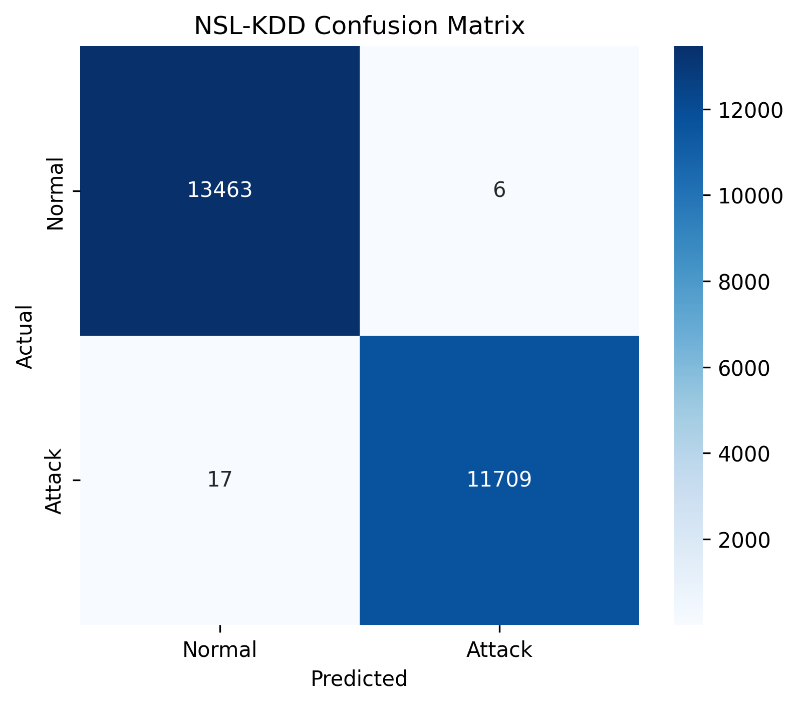
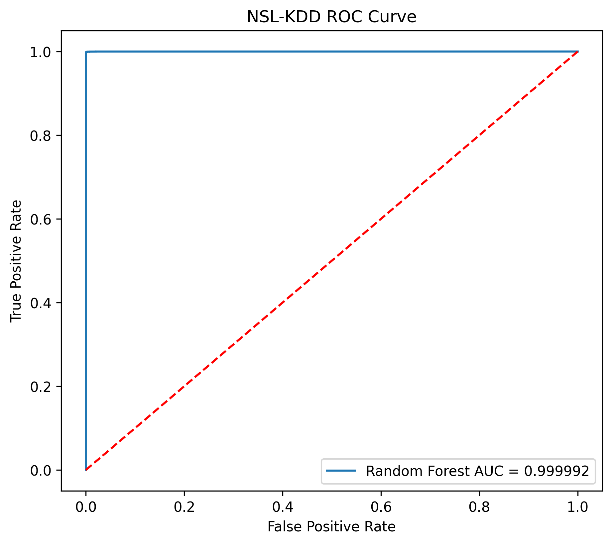
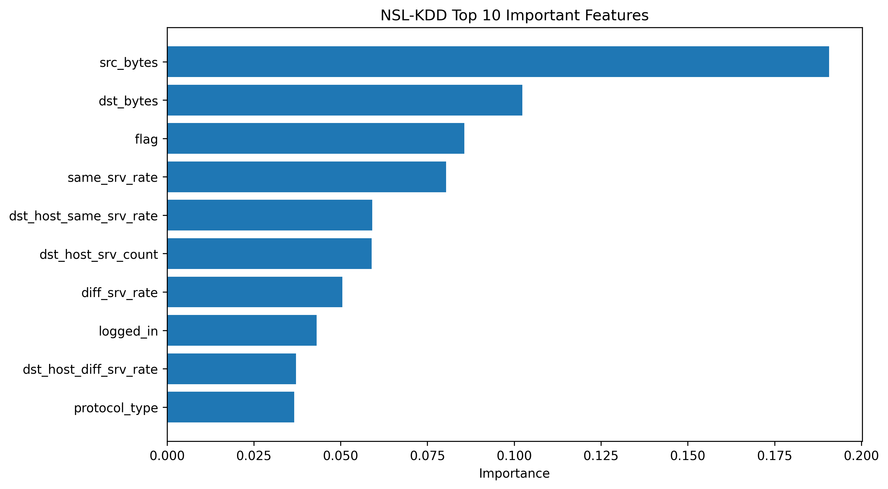
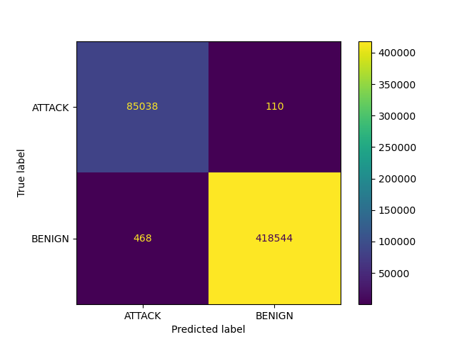
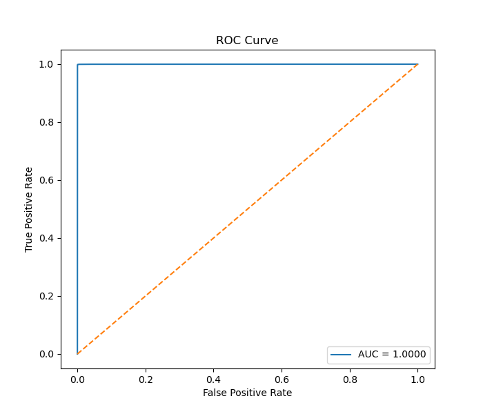
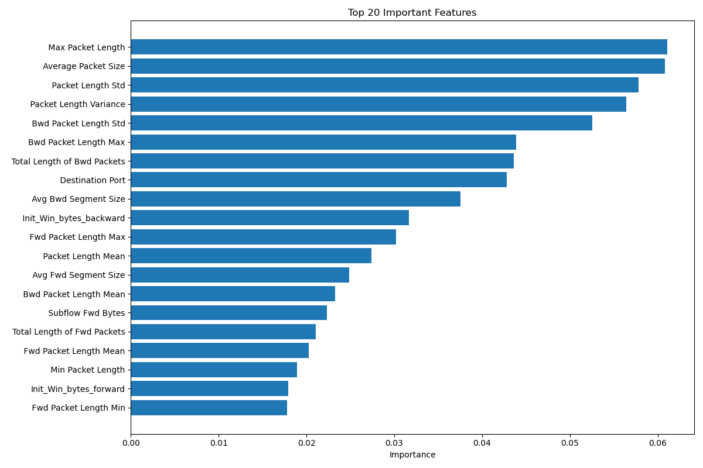

# 🚀 Network Anomaly Detection using Machine Learning

> **A Machine Learning-based Network Intrusion Detection System (NIDS) using Random Forest Classifier on NSL-KDD and CICIDS2017 datasets.**


---

# 📌 Project Overview

Cyber attacks are increasing rapidly, making network security more important than ever.

This project develops a **Network Intrusion Detection System (NIDS)** using **Machine Learning** to automatically classify network traffic as:

- ✅ Normal Traffic
- ⚠️ Malicious Traffic (Attack)

The system is trained and evaluated using two benchmark datasets:

- **NSL-KDD**
- **CICIDS2017**

using the **Random Forest Classifier**.

---

# 🎯 Objectives

- Detect malicious network traffic automatically
- Reduce false positives
- Improve intrusion detection accuracy
- Compare performance on benchmark datasets
- Build a reusable ML-based security solution

---

# 📂 Project Structure

```text
Network Anomaly Detection/
│
├── data/
│   ├── NSL-KDD/
│   └── CICIDS-2017/
│
├── notebooks/
│   ├── nsl_kdd_model_train.ipynb
│   └── cicids_model_train.ipynb
│
├── src/
│   ├── nsl_kdd_preprocessing.py
│   ├── nsl_kdd_train_model.py
│   ├── nsl_kdd_model_evaluation.py
│   ├── cicids_preprocessing.py
│   ├── cicids_train_model.py
│   └── cicids_model_evaluation.py
│
├── models/
│
├── reports/
│
├── requirements.txt
├── README.md
└── .gitignore
```

---

# 🗂️ Datasets Used

## NSL-KDD

- KDDTrain+.txt
- KDDTest-21.txt

Benchmark dataset for intrusion detection research.

---

## CICIDS2017

Contains modern network attacks including:

- DDoS
- Port Scan
- Web Attacks
- Infiltration
- Brute Force
- Botnet
- Normal Traffic

---

# ⚙️ Machine Learning Pipeline

```
Raw Dataset
      │
      ▼
Data Cleaning
      │
      ▼
Feature Encoding
      │
      ▼
Binary Label Conversion
      │
      ▼
Train-Test Split
      │
      ▼
Random Forest Training
      │
      ▼
Prediction
      │
      ▼
Evaluation Metrics
      │
      ▼
Confusion Matrix
ROC Curve
Feature Importance
```

---

# 🤖 Algorithm Used

- **Random Forest Classifier**

Why Random Forest?

- High Accuracy
- Handles Large Datasets
- Robust Against Overfitting
- Feature Importance Analysis
- Fast Prediction

---

# 📊 NSL-KDD Results

| Metric | Score |
|------------|------------|
| Training Accuracy | **99.97%** |
| Testing Accuracy | **99.91%** |
| Precision | **99.95%** |
| Recall | **99.86%** |
| F1 Score | **99.90%** |
| ROC-AUC | **0.999992** |

---


# 📊 CICIDS2017 Results

| Metric | Score |
|------------|------------|
| Training Accuracy | **99.99%** |
| Testing Accuracy | **99.85%** |
| Precision | **99.93%** |
| Recall | **99.88%** |
| F1 Score | **99.91%** |
| ROC-AUC | **0.999936** |

---
# 📈 Evaluation Metrics

The project generates:

- ✅ Accuracy
- ✅ Precision
- ✅ Recall
- ✅ F1 Score
- ✅ ROC-AUC
- ✅ Classification Report
- ✅ Confusion Matrix
- ✅ Feature Importance Graph

---

# 📁 Generated Outputs

## Models

- nsl-kdd_anomaly_model.pkl
- cicids_anomaly_model.pkl

## Encoders

- nsl-kdd_label_encoder.pkl
- cicids_label_encoder.pkl

## Reports

- Confusion Matrix
- ROC Curve
- Feature Importance
- Metrics Report

---
# 📊 Model Evaluation Visualizations

## NSL-KDD Results

### Confusion Matrix


### ROC Curve


### Feature Importance


---

## CICIDS2017 Results

### Confusion Matrix


### ROC Curve


### Feature Importance

# 🛠️ Technologies Used

- Python
- Pandas
- NumPy
- Scikit-Learn
- Matplotlib
- Seaborn
- Joblib
- Jupyter Notebook

---

# ▶️ How to Run

Install dependencies:

```bash
pip install -r requirements.txt
```

Train NSL-KDD model:

```bash
python src/nsl_kdd_train_model.py
```

Evaluate NSL-KDD model:

```bash
python src/nsl_kdd_model_evaluation.py
```

Train CICIDS model:

```bash
python src/cicids_train_model.py
```

Evaluate CICIDS model:

```bash
python src/cicids_model_evaluation.py
```

---

# 📌 Future Enhancements

- Flask Web Application
- Streamlit Dashboard
- Real-time Packet Capture
- Deep Learning Models (LSTM/CNN)
- Live Network Monitoring
- Explainable AI (SHAP)

---

# 👨‍💻 Author

## **Aditya Raikar**

**Bachelor of Engineering (Computer Science)**

**Major Project**

**Network Anomaly Detection using Machine Learning**

---

